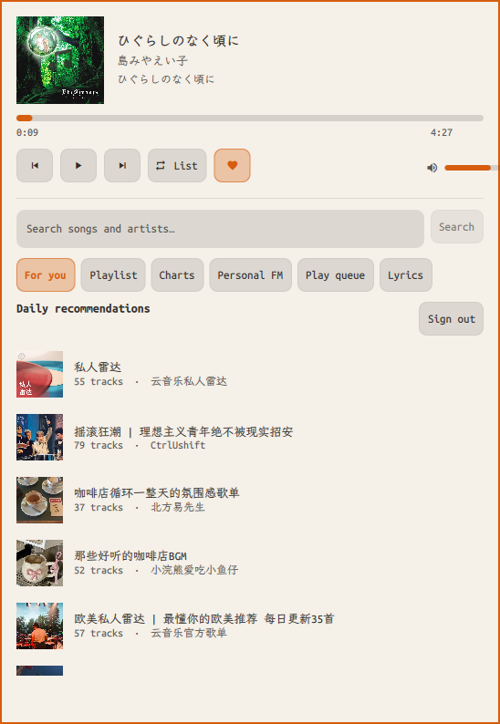

# Omarchy Musicfox

[English](README.en.md) | 简体中文

**当前开发版本：0.1.3。** 在插件接口、账户存储与播放行为稳定之前，项目将保持
`0.x` 版本，不会提前标记为 `1.0.0`。

一个原生的 [Omarchy Quattro](https://omarchy.org/manual/shell-plugins/) 网易云音乐插件。
它借鉴 [go-musicfox](https://github.com/go-musicfox/go-musicfox) 的产品能力，但不是它的
控制器，也不会安装、启动或调用 `musicfox`：登录、内容浏览、播放队列和播放器均由本插件独立实现。



## 功能

- 网易云二维码登录、Cookie 登录与退出登录
- 每日推荐、推荐歌单、搜索、我的歌单、排行榜、私人 FM
- 歌单详情、播放队列、上一首/下一首、单曲循环、列表循环、随机播放
- 封面、歌词与翻译歌词、播放进度、跳转、音量、喜欢歌曲
- `standard` 至 `hires` 等网易云音质等级的后端支持
- 自动跟随系统语言，并可手动选择简体中文或 English
- 可选 MPRIS 系统媒体会话，可使用键盘媒体键及兼容的桌面控制器
- 原生 Omarchy 顶栏状态与完整弹出面板
- 登录 Cookie 持久化到本机，不把账户数据交给插件作者或第三方服务

## 架构与依赖

```diagram
Omarchy QML 界面 ──逐行 JSON──▶ 插件内置 Go helper ──HTTPS──▶ 网易云接口
                                      │
                                      └──Unix IPC──▶ mpv 音频引擎
```

运行时**不依赖 go-musicfox / musicfox**。需要：

- Omarchy 4 / Quattro Shell
- `mpv`（Omarchy 默认提供）
- x86-64 Linux（仓库已附带静态 helper）；其他架构需要 Go 1.22+ 自行构建

插件使用 `go-musicfox/netease-music` MIT SDK 访问网易云协议接口。该接口不是网易云官方
公开 API，可能随服务端调整而变化；使用本插件仍须遵守网易云音乐服务条款及所在地法律。

## 安装

```sh
omarchy plugin add https://github.com/taotao7/omarchy-musicfox.git --enable
```

本地开发：

```sh
git clone https://github.com/taotao7/omarchy-musicfox.git ~/.config/omarchy/plugins/taotao7.musicfox
cd ~/.config/omarchy/plugins/taotao7.musicfox
./scripts/build-helper.sh
omarchy plugin validate .
omarchy plugin enable taotao7.musicfox center
```

不要用符号链接代替插件目录；Omarchy 会拒绝插件目录中的链接。

卸载插件：

```sh
omarchy plugin remove taotao7.musicfox
```

卸载不会自动删除账户状态。如需同时清理 Cookie 和二维码缓存：

```sh
rm -rf ~/.local/state/omarchy-musicfox ~/.cache/omarchy-musicfox
```

## 使用

| 操作 | 行为 |
| --- | --- |
| 空闲时左键/右键 | 打开播放器面板 |
| 播放时左键 | 播放/暂停 |
| 中键 | 下一首 |
| 滚轮 | 上一首/下一首 |

首次打开面板后，可点击“生成登录二维码”，使用网易云音乐 App 扫码。也可以从已登录的
`music.163.com` 浏览器会话复制包含 `MUSIC_U` 或 `MUSIC_A` 的 Cookie 并导入。

账户 Cookie 保存于：

```text
~/.local/state/omarchy-musicfox/cookies.json
```

目录权限为 `0700`，Cookie 文件在首次写入后设置为 `0600`。二维码缓存位于
`~/.cache/omarchy-musicfox/`。退出登录会清空本地 Cookie。

## 设置

使用 **Setup → Bar → Configure**，或命令行：

```sh
omarchy bar set taotao7.musicfox displayMode "Title and artist"
omarchy bar set taotao7.musicfox hideWhenIdle false
omarchy bar set taotao7.musicfox maxLabelWidth 220
omarchy bar set taotao7.musicfox audioQuality higher
omarchy bar set taotao7.musicfox mprisEnabled false
omarchy bar set taotao7.musicfox language Auto
omarchy bar move taotao7.musicfox --section center
```

MPRIS 默认关闭，因为启用后 Omarchy 自带的 `omarchy.media` 也会显示当前歌曲，与
Musicfox 自己的顶栏组件形成重复。需要媒体键时可将 `mprisEnabled` 设为 `true`；这不会
让内部 mpv 再额外注册一个媒体会话。

## 从源码构建与验证

```sh
./scripts/build-helper.sh
./scripts/check.sh
```

构建脚本生成静态 `bin/omarchy-musicfox-helper`。验证包括官方 manifest 校验、Go
单元测试、`go vet`、helper 构建，以及针对 Omarchy Shell imports 的 `qmllint`。

运行排错：

```sh
omarchy plugin list
omarchy-shell shell summon taotao7.musicfox '{}'
qs log -p "$OMARCHY_PATH/shell" --tail 100
```

## 安全

所有第三方 Omarchy 插件都会以当前用户权限、不经沙箱地运行在长期驻留的
`omarchy-shell` 中，请在启用前审阅源码。插件不会静默下载程序、请求提权或执行账户
Cookie；QML 与 helper 通过结构化 JSON 通信，音频 URL 仅交给本机 `mpv`。

## 许可证

本项目为 MIT。第三方依赖及归属见 [THIRD_PARTY_NOTICES.md](THIRD_PARTY_NOTICES.md)。
